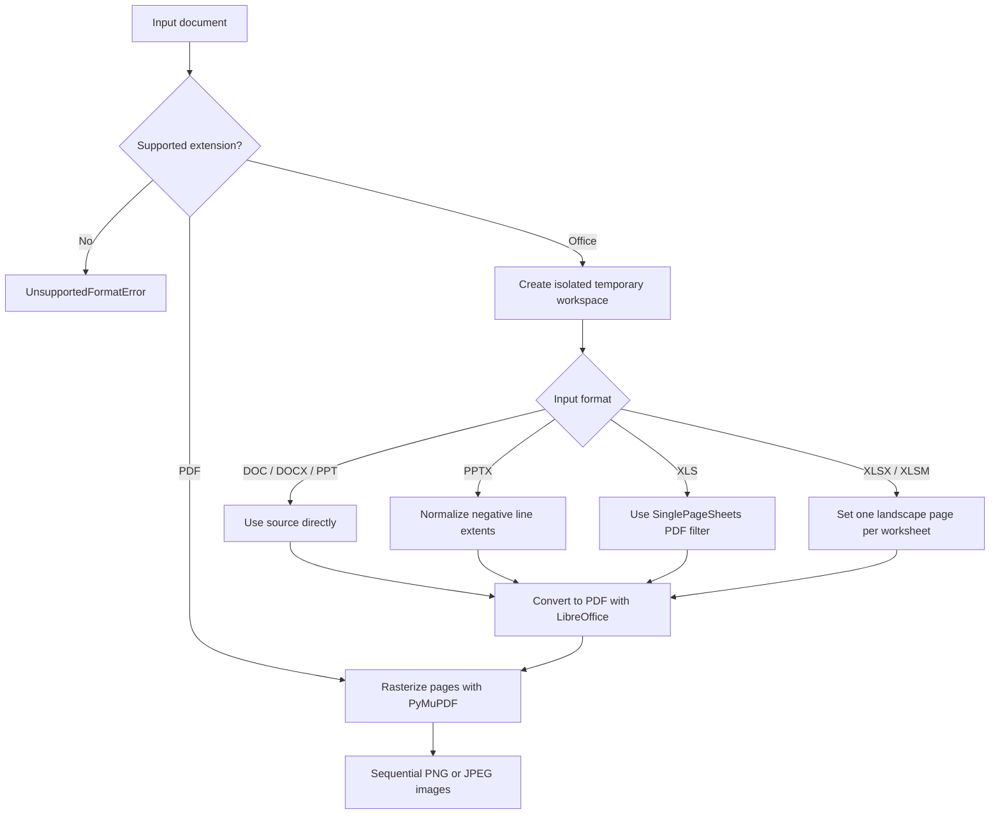

# document-image-renderer Design

## Purpose

`document-image-renderer` is a Python library that converts PDF, DOC, DOCX, PPT, PPTX, XLS, XLSX, and XLSM content into images, one image per page or worksheet.
It provides a public API for other Python projects and a command-line interface for the same functionality.

## Scope

| Input family | Extensions | Output unit | Office conversion |
|---|---|---|---|
| PDF | `.pdf` | Page | None |
| Word | `.doc`, `.docx` | Page | LibreOffice Writer |
| PowerPoint | `.ppt`, `.pptx` | Slide | LibreOffice Impress |
| Excel | `.xls`, `.xlsx`, `.xlsm` | Worksheet | LibreOffice Calc |

Output formats are lossless PNG and quality-configurable JPEG. XLS uses content-sized PDF pages through LibreOffice's `SinglePageSheets` export option. XLSX and XLSM use one landscape page per worksheet.
Hidden worksheets, print areas, and margins otherwise follow LibreOffice PDF output behavior.

Encrypted documents, corrupted documents, and macro execution are out of scope.

## Reproducibility

In this library, **complete reproduction** means rendering every page fixed in the intermediate PDF at the requested resolution without omission when the same LibreOffice version, PyMuPDF version, fonts, and locale are used.
Office documents are laid out by LibreOffice rather than Microsoft Office. Differences in rendering engines, font metrics, and supported features can therefore change the output.
Pixel-for-pixel equivalence with Microsoft Office is not guaranteed across arbitrary environments.

When redistribution is permitted, fonts used by source documents can be added to `.devcontainer/fonts/` to avoid font substitution.

## Conversion Process



The pipeline has three conceptual stages:

1. Validate the input and prepare a temporary Office copy when required.
2. Convert Office input to PDF with LibreOffice in headless mode.
3. Rasterize every PDF page to PNG or JPEG with PyMuPDF at the requested DPI.

Using PDF as an intermediate representation preserves page dimensions, text, shapes, images, and placement without reimplementing format-specific rendering in this library.
For PDF input, preprocessing and LibreOffice conversion are skipped.

### Format-specific preparation

| Format | Preparation | Rationale |
|---|---|---|
| DOC, DOCX | None | Direct PDF conversion avoids an unnecessary intermediate format. |
| PPT | None | Direct PDF conversion avoids additional presentation layout changes. |
| PPTX | Normalize negative line widths and heights in a temporary OOXML copy. | PowerPoint corrects these values for display, while LibreOffice can mirror the line. |
| XLS | Select `SinglePageSheets` in the Calc PDF export filter. | XLS is binary and cannot use the OOXML worksheet rewrite. |
| XLSX, XLSM | Apply `fitToPage`, `fitToWidth=1`, `fitToHeight=1`, and landscape orientation in a temporary OOXML copy. | Produces one fixed-format page per worksheet. |

The original input is never modified. If ZIP or XML parsing fails during OOXML preprocessing, the original file is passed to LibreOffice so the normal conversion error path can report the failure.

### Temporary workspace

LibreOffice receives a temporary user profile for each conversion.
This prevents concurrent processes from contending for the default profile lock and removes user-specific settings from the conversion path.
Intermediate PDFs, temporary Office copies, and profiles are deleted when the `TemporaryDirectory` context exits.

## Public API

The primary API has the following form:

```python
from pathlib import Path

from document_image_renderer import RenderOptions, render_document

result = render_document(
    Path("samplefile.docx"),
    Path("output"),
    options=RenderOptions(dpi=200, image_format="png"),
)

for image in result.images:
    print(image.path, image.width, image.height)
```

`RenderOptions` stores the DPI, image format, JPEG quality, transparent-background behavior, output file name prefix, and LibreOffice execution settings.
The defaults prioritize quality and produce 200 DPI PNG images.

`RenderResult` stores the input path, generated image metadata, and page count.
Generated images follow the page order of the source document.

Input and output paths accept `str` or `os.PathLike` values.
Existing output files are replaced so that conversions can be repeated.
Unrelated files in the output directory are not deleted.

## Errors

The following public exceptions allow callers to handle failures by cause:

- `UnsupportedFormatError`: The input extension is not supported.
- `DependencyNotFoundError`: LibreOffice required for Office conversion cannot be found.
- `DocumentConversionError`: LibreOffice fails or does not produce a PDF.
- `DocumentRenderError`: A PDF cannot be opened or a page cannot be rasterized.

Exception messages include the input file and failed operation.
LibreOffice standard output and standard error are retained on `DocumentConversionError` for diagnostics.

## Security and Resource Control

LibreOffice commands are executed as argument arrays without invoking a shell.
The isolated LibreOffice profile sets macro security to Very High, preventing document macros, including XLSM macros, from running during conversion.

The public API supports a LibreOffice timeout.
However, the page count, expanded document size, and total image pixel count cannot be known in advance. Services that process untrusted documents must also limit processes, CPU, memory, and storage.

## Package Structure

```text
src/
  document_image_renderer/
    __init__.py
    cli.py
    exceptions.py
    models.py
    py.typed
    renderer.py
tests/
  fixtures/
    documents/
  test_integration.py
  test_renderer.py
example/
  convert_documents.py
```

The project uses `pyproject.toml` and Hatchling for builds.
PyMuPDF, which handles PDF rendering, is the only runtime Python dependency. LibreOffice is an optional system dependency required only for Office documents.

## Testing Strategy

Unit tests verify sequential rendering of every PDF page, DPI-derived image dimensions, JPEG options, input validation, and exception conversion.
They also verify negative PPTX line normalization, XLSX/XLSM worksheet settings, the XLS PDF export filter, legacy DOC/PPT routing, and macro security configuration.
LibreOffice execution is isolated behind a small boundary and replaced in unit tests.

Integration tests dynamically collect every file directly under `tests/fixtures/documents/`. The fixtures cover all eight supported extensions. Tests assert that at least one image is generated and reopen every image with PyMuPDF.
Office integration tests are skipped on hosts without LibreOffice and run in the dev container or a CI container.

Pixel-level regressions can be detected by comparing perceptual hashes or image differences against reference images in an environment with fixed fonts and tool versions.
Because tool updates can change layout, reference images should be updated only after visual review of the differences.